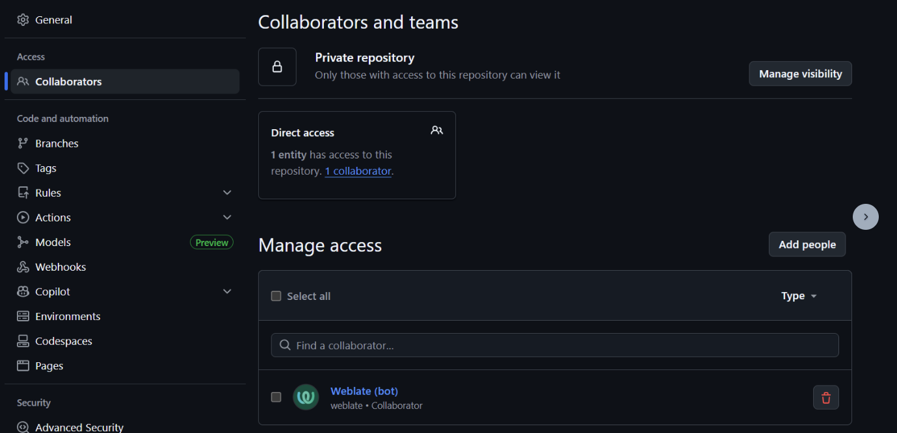
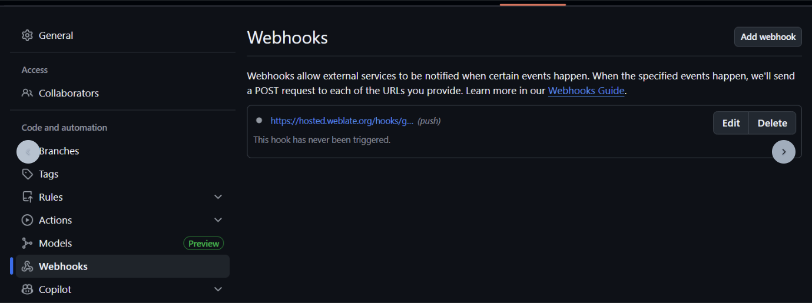
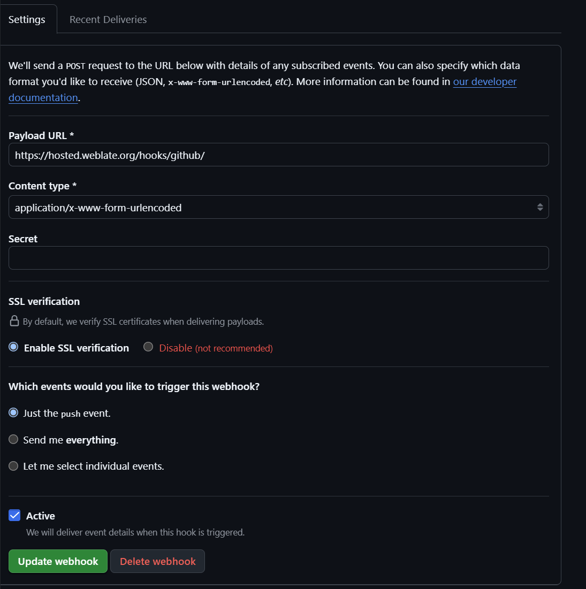

# Onboard a Weblate Component

How to add translatable components to [Hosted Weblate](https://hosted.weblate.org/projects/axonivy/#components).


## 1. Manual GitHub Setup

GitHub access setup for Weblate is not automated and must be configured before Weblate onboarding as follows.

### Invite Collaborator

1. Ensure the GitHub repository is public, as required by the free Libre hosting plan described in the source guide.
2. Add the **Weblate (bot)** account as a repository collaborator with `write` access. It can take about 5 minutes for Weblate to accept the invitation.



### Setup Webhook

1. Create a new webhook for the URI `https://hosted.weblate.org/hooks/github/`

Stick to defaults:
- Payload URL: `https://hosted.weblate.org/hooks/github/`
- Content type: `application/x-www-form-urlencoded`
- Events: push only
- SSL verification: enabled
- Active: enabled

After creating the webhook, check its recent deliveries and confirm Weblate receives a successful push notification.




## 2. Automated Weblate onboarding

After Github setup, the onboarding to Weblate can be completed by running the [onboard-component.sh](../scripts/onboard-component.sh) script.

To run the script, generate an API token in your Weblate user settings.
Pass it through the `WEBLATE_TOKEN` environment variable when invoking the script.

`WEBLATE_TOKEN=abc_1234xyz ./scripts/onboard-component.sh`

## 3. Manual Github Finalization

Add a badge to your README.md so that users can easily access translations.

⚠️ The batch is mandatory, as part of the free hosting agreement.

```md
<!-- replace YOUR_COMPONENT with the component name you onboarded -->
[](https://hosted.weblate.org/engage/axonivy/)

```
